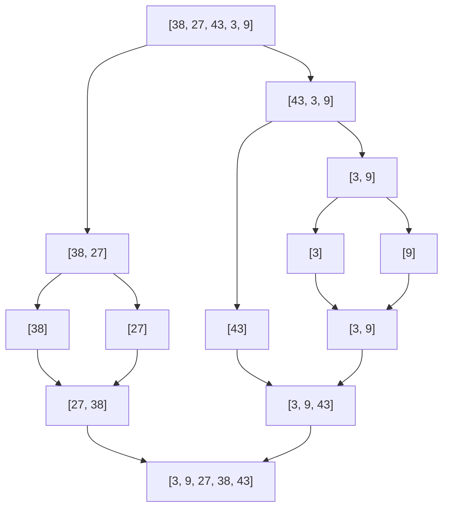

+++
title = "Algorithms: Mergesort"
author = ["Ben Mezger"]
date = 2026-02-22T13:51:00+01:00
slug = "algorithms_mergesort"
tags = ["algorithms"]
type = "notes"
draft = false
bookCollapseSection = true
+++

-   Related pages
    -   [Algorithms: Binary Search]()
    -   [Algorithms: Quicksort]()
    -   [Algorithms: Selection and Insertion Sort]()

---



I wrote about how quicksort can be faster than selection sort when sorting
arrays that are bigger in size, and I've also mentioned that we could find a
better sorting algorithm than quicksort.

The problem about quicksort is that in the worst case, it takes \\(O(n^2)\\) time to
complete, while maintaining \\(O(n \log\_2 n)\\) as average and best. Mergesort
maintains \\(O(n \log\_2 n)\\) fixed, both as best and worst case.

Mergesort is a divide-and-conquer algorithm, whereby our list is subdivided
repeatedly in half until our sublist has size 1. The pairs of sublists are then
merged to preserve the sort. A visual representation for a given array of \\([38,
27, 43, 3, 9]\\) would be the following:



Our base case (when our recursion needs to stop) is when the length of `arr`
\\(\leq 1\\). At this point, we return the array as-is; the actual sorting happens
during the merge phase as the call stack unwinds.

<a id="code-snippet--mergesort-fn"></a>
```python
def mergesort(arr: list[int]) -> list[int]:
    n = len(arr)

    # our base case
    if n <= 1:
        return arr

    # divide phase
    mid = n // 2
    left = mergesort(arr[:mid])
    right = mergesort(arr[mid:])

    # conquer phase
    idx_left = 0
    idx_right = 0

    arr: list[int] = []
    while idx_left < len(left) and idx_right < len(right):
        if left[idx_left] > right[idx_right]:
            arr.append(right[idx_right])
            idx_right += 1
        elif left[idx_left] < right[idx_right]:
            arr.append(left[idx_left])
            idx_left += 1
        else:
            arr.append(left[idx_left])
            arr.append(right[idx_right])
            idx_right += 1
            idx_left += 1

    arr.extend(left[idx_left:])
    arr.extend(right[idx_right:])

    return arr
```

If we look at how it performs:

```python
from helpers import benchmark, plot_benchmark_results
import random

results = {}
for size in [10, 100, 1000, 10000]:
    arr = list(range(size))
    random.shuffle(arr)
    results[size] = benchmark(
        lambda a: mergesort(a),
        arr, size,
        number=10000,
        name="mergesort",
        print_avg=False
    )

plot_benchmark_results(results, name="mergesort")
```

```text

--- mergesort ---
   10 |                                                    0.0073 ms
  100 |                                                    0.0753 ms
 1000 | ████                                               0.9355 ms
10000 | ██████████████████████████████████████████████████ 11.2962 ms
```

Much faster than selection sort (\\(O(n^2)\\) vs \\(O(n \log\_2 n)\\)), and comparable
to quicksort (given quicksort's average and best cases are \\(O(n \log\_2 n)\\)),
though quicksort's performance depends on the pivot chosen, reaching \\(O(n^2)\\) on
bad pivots.

The reason Mergesort is always \\(O(n \log\_2 n)\\) is related to how it behaves on
sorted and unsorted lists. Mergesort breaks down the list and puts it back
together regardless of whether the list is already sorted or unsorted.
